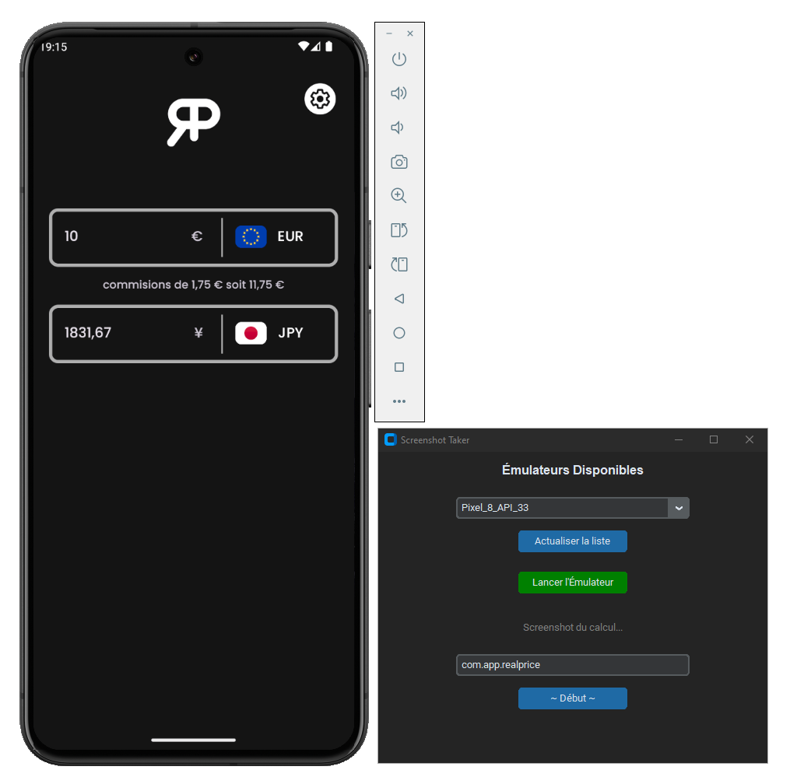

    <b>:fr: Français</b> | <a href="./README.en.md">:uk: English</a>

# Screenshot Taker
Application Python permettant de prendre automatiquement des captures d’écran d’une application. Actuellement, elle est calibrée pour l’application **RealPrice** ([`com.app.realprice`](https://play.google.com/store/apps/details?id=com.app.realprice)), mais si vous souhaitez l’adapter à votre application, il vous suffit de modifier le fichier `main.py`.

### Utilisation
Vous devez disposer du logiciel **Android Studio** et avoir installé au moins un **AVD** (Android Virtual Device). De plus, assurez-vous d’avoir correctement installé toutes les bibliothèques Python nécessaires. Il suffit ensuite de lancer l’application `main.py`.

### Modification
Si vous souhaitez adapter cette application à la vôtre, vous pouvez créer vos propres commandes en utilisant l’outil **adb**, en modifiant le fichier `service/taker.py`.

Voici les fonctionnalités utilisées pour mon application :

| Fonction | Description |
| -------- | ----------- |
| `change_lang_and_restart` | Change la langue de l’application, puis la redémarre |
| `tap_id` | Simule un clic sur un élément à partir de son identifiant, récupérable dans les layouts de l’application. Exemple : `android:id="@+id/currency_input_money_amount"`, l’identifiant est donc `currency_input_money_amount` |
| `clear_text` | Supprime le contenu d’un champ texte en appuyant `n` fois sur la touche `backspace`. |
| `add_text` | Ajoute du texte dans un champ texte |
| `take_screenshot` | Prend une capture d’écran de l’émulateur Android |
 